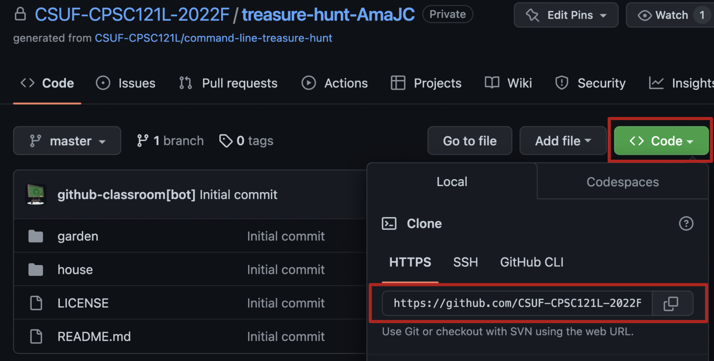

# Treasure Hunt

## Navigation

* [Introduction](#introduction)
* [Find the Treasure](#find-the-treasure)

## Introduction
In this exercise, you will use the command line to find the hidden treasure. Here are some of the commands you'll find useful:

``cd`` to change directories

``ls`` to list files in a directory

``pwd`` to find out where you currently are

``cat`` to print a file to the terminal

Ready to get started? Open a terminal and let's go!

## Find the Treasure
First, clone this repository so you can access the files on your computer. You'll use the `git clone` command, which requires a link to specify the repository you want to copy to your local computer. You can find the link by clicking the "Code" button in the GitHub repo, which opens a popup where you can copy the repo link:


Substitute `<link>` for the GitHub repository link, and run the following command on your terminal:
```
git clone <link>
```
Next, use `cd` to change directories into the repository:
```
cd command-line-treasure-hunt
```

Now, start by typing `ls` in the terminal to list files, and you see this output:

```
garden house LICENSE README.md gitcloneguide.png
```

The words ``garden`` ``house`` are bold or a different color because they are directories (aka folders). ``LICENSE``, ``gitcloneguide.png``, and ``README.md`` are files. Type ``cat README.md`` in the terminal to see this file!

Now let's go exploring. Go into the garden directory: ``cd garden``. Once you get there, ``ls`` to see what's around, and ``cat README.md`` to see your next set of instructions.

```
cd garden
ls
cat README.md
```

Tip: you can press the Tab button to autocomplete file or directory names!

Good luck!
